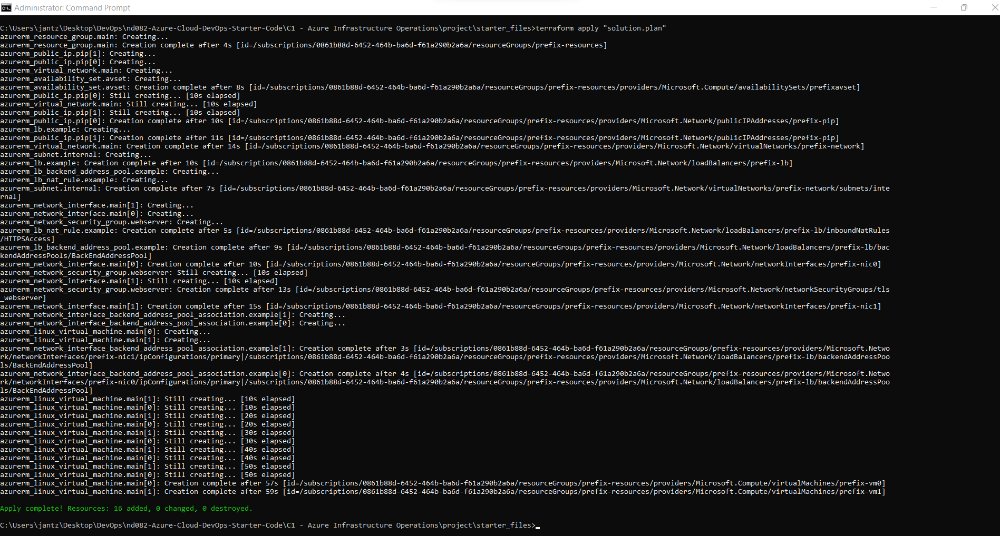

# Azure Infrastructure Operations Project: Deploying a scalable IaaS web server in Azure

### Introduction
For this project, you will write a Packer template and a Terraform template to deploy a customizable, scalable web server in Azure.

### Getting Started
1. Clone this repository

2. OPTIONAL - set the local environment variables for `ARM_CLIENT_ID`, `ARM_CLIENT_SECRET`, `ARM_SUBSCRIPTION_ID` and `ARM_TENANT_ID`

3. Create your infrastructure as code by following the instructions below

### Dependencies
1. Create an [Azure Account](https://portal.azure.com) 
2. Install the [Azure command line interface](https://docs.microsoft.com/en-us/cli/azure/install-azure-cli?view=azure-cli-latest)
3. Install [Packer](https://www.packer.io/downloads)
4. Install [Terraform](https://www.terraform.io/downloads.html)

### Customization (`variables.tf`)
The `variables.tf` file allows for easier configuration and dynamic deployments. By default, the file contains the variables (`prefix`, `tags`, `subscription_id`, `client_id`, `client_secret`, `tenant_id`, `location`, and `instance_count`). These variables are referenced within the file `main.tf`, and you will be prompted to supply a value upon deployment if a default value is not defined.

If you would like to extend the variable options, you can add additional entries to the `variables.tf` file and reference those values where needed within `main.tf` either directly such as `tags = var.tags` or using "String Interpolation" - such as `name = "${var.prefix}-resources"`.

### Instructions
Once you've collected your dependencies, to build your Infrastructure:
1. **Deploy a Policy** to deny the creation of resources without tags by running `az policy definition create` followed by `az policy assignment create`
2. **Create a Packer Template** using a `server.json` file and completing the necessary `builders` and `provisioners` sections
3. **Create a Terraform Template** using a `variables.tf` file and a `main.tf` file that includes all of the necessary infrastructure to create a highly available, secure, and publicly accessible Ubuntu web server
4. **Deploy your Infrastructure** by running `packer build` followed by `terraform init`, `terraform plan`, and `terraform apply`
5. **Clean Up** when you are finished with the deployment by running `terraform destroy`

If you wish to build more than one server, repeat step 4 before destroying your infrastructure in step 5 to avoid reaching Azure usage limits.

### Output
Result of `az policy assignment list` after running the command above

Result of `terraform plan` after running the command above

Result of `terraform apply` after running the command above
